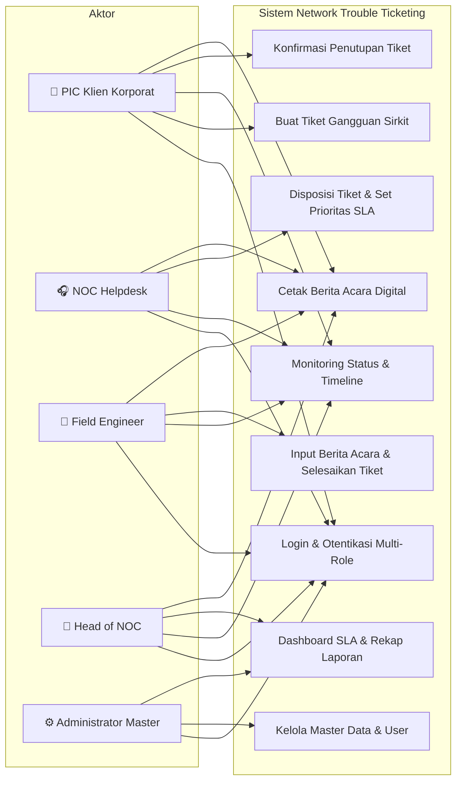
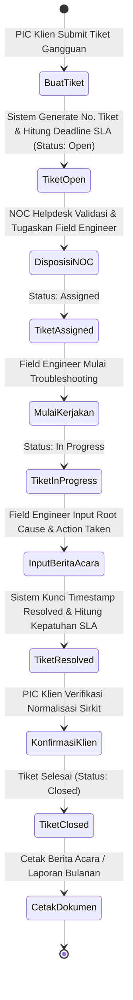
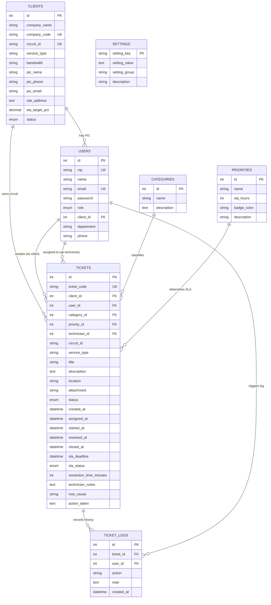

# 📑 Naskah Lengkap & Materi Laporan KKP (Kuliah Kerja Praktek)

**Judul Penelitian / Laporan KKP:**  
> **"Rancang Bangun Sistem Informasi Network Trouble Ticketing Berbasis Web untuk Meningkatkan Efisiensi Penanganan Gangguan Jaringan pada PT. Visimedia Pratama Persada"**

**Instansi Tempat KKP:** PT. Visimedia Pratama Persada  
**Divisi:** Network Operations Center (NOC) & Customer Care B2B  
**Target Output:** Sistem Informasi Web Trouble Ticketing & SLA Tracking, Docker Containerization, CI/CD Deployment.

---

## 📋 DAFTAR ISI MATERI KKP
1. [BAB 1: PENDAHULUAN](#bab-1-pendahuluan)
   - 1.1 Latar Belakang Masalah
   - 1.2 Rumusan Masalah
   - 1.3 Batasan Masalah
   - 1.4 Tujuan Penelitian
   - 1.5 Manfaat Penelitian
2. [BAB 2: LANDASAN TEORI & METODOLOGI](#bab-2-landasan-teori--metodologi)
   - 2.1 Konsep Managed Network Service & Trouble Ticketing B2B
   - 2.2 Konsep Service Level Agreement (SLA) & MTTR
   - 2.3 Metodologi Waterfall (SDLC)
   - 2.4 Teknologi & Arsitektur (PHP 8.2, MariaDB, Docker, CI/CD)
3. [BAB 3: ANALISIS DAN PERANCANGAN SISTEM](#bab-3-analisis-dan-perancangan-sistem)
   - 3.1 Analisis Sistem Berjalan vs Sistem Usulan
   - 3.2 Identifikasi Aktor & Matriks Hak Akses (RBAC)
   - 3.3 Pemodelan UML (Use Case, Activity, Sequence, Class Diagram)
   - 3.4 Perancangan Basis Data (Entity Relationship Diagram - ERD)
   - 3.5 Matriks Standar SLA & Logika Perhitungan Kepatuhan
4. [BAB 4: IMPLEMENTASI DAN PENGUJIAN SISTEM](#bab-4-implementasi-dan-pengujian-sistem)
   - 4.1 Struktur Direktori & Arsitektur Modul
   - 4.2 Standarisasi Dokumen Cetak Digital Paperless (A4 Formal)
   - 4.3 Containerization Docker & CI/CD GitHub Actions
   - 4.4 Pengujian Sistem (Black Box Testing)
5. [BAB 5: KESIMPULAN DAN SARAN](#bab-5-kesimpulan-dan-saran)
   - 5.1 Kesimpulan
   - 5.2 Saran Pengembangan
6. [🎯 BANK TANYA-JAWAB (Q&A) SIDANG KKP](#-bank-tanya-jawab-qa-sidang-kkp)

---

## BAB 1: PENDAHULUAN

### 1.1 Latar Belakang
**PT. Visimedia Pratama Persada** merupakan perusahaan penyedia infrastruktur jaringan telekomunikasi dan *Managed Network Services* berbasis *Business-to-Business* (B2B). Layanan utama yang disediakan mencakup *Dedicated Internet Corporate*, *Metro Ethernet Point-to-Point*, *IP VPN MPLS Inter-Branch*, dan *Managed SD-WAN Corporate* kepada berbagai mitra korporat terkemuka (antara lain perbankan, manufaktur, properti, dan logistik) di Indonesia.

Ketersediaan (*availability*) dan stabilitas sirkit jaringan merupakan komitmen krusial yang tertuang dalam perjanjian tingkat layanan (*Service Level Agreement* / SLA) kontrak bisnis dengan target *uptime* rata-rata $\ge 99.5\%$. Namun, pada operasional harian di divisi *Network Operations Center* (NOC), proses penanganan gangguan sirkit dari klien korporat sebelumnya masih menghadapi kendala mendasar:

1. **Saluran Pelaporan Bersifat Konvensional & Terpencar**: Klien korporat menyampaikan komplain sirkit melalui WhatsApp personal, panggilan telepon, atau email non-standar. Hal ini mengakibatkan komplain terlewat (*missed ticket*), ketiadaan nomor tiket (*tracking ID*) resmi, dan kesulitan mencocokkan nomor sirkit (*Circuit ID*).
2. **Ketiadaan Transparansi Status Real-Time**: PIC Klien tidak dapat mengetahui secara langsung tahapan penanganan teknisi PT. Visimedia Pratama Persada (apakah tiket sudah divalidasi NOC, Field Engineer sudah ditugaskan, atau proses perbaikan sedang berjalan di lokasi *site*).
3. **Pengukuran Batas Waktu SLA Masih Manual**: Pengukuran durasi perbaikan (*Mean Time to Resolve* / MTTR) dan status kepatuhan SLA (*Within SLA vs Breached*) masih dihitung manual pada spreadsheet, sehingga rentan manipulasi data atau selisih hitung saat audit evaluasi kontrak bulanan.
4. **Dokumentasi Berita Acara Masih Berbasis Kertas Fisik**: Lembar kerja teknisi dan berita acara pemulihan jaringan sering terlambat diarsip, tercecer, atau tidak memiliki validasi digital sistemik yang terpadu.

Berdasarkan permasalahan di atas, dirancang dan dibangun **Sistem Informasi Network Trouble Ticketing Berbasis Web** pada PT. Visimedia Pratama Persada yang mengintegrasikan pencatatan *Circuit ID*, pemantauan batas waktu SLA otomatis (*real-time countdown*), standarisasi dokumen Berita Acara Digital, arsitektur *containerization* Docker, dan *deployment* otomatis CI/CD.

---

### 1.2 Rumusan Masalah
1. Bagaimana merancang dan membangun sistem informasi *Network Trouble Ticketing* berbasis web untuk mengelola keluhan gangguan sirkit jaringan klien korporat secara terpusat pada **PT. Visimedia Pratama Persada**?
2. Bagaimana menerapkan sistem pemantauan batas toleransi *Service Level Agreement* (SLA) otomatis berbasis prioritas dampak (*Critical, High, Medium, Low*) untuk mengukur kepatuhan waktu penanganan teknisi (*Within SLA vs Breached*)?
3. Bagaimana merancang dokumen digital Berita Acara Troubleshooting dan Laporan Bulanan SLA berstandar korporat tanpa ketergantungan tanda tangan manual fisik (*paperless validation*)?
4. Bagaimana mengimplementasikan *containerization* Docker dan *pipeline* CI/CD GitHub Actions agar sistem dapat di-*deploy* secara otomatis ke server produksi Ubuntu Linux?

---

### 1.3 Batasan Masalah
1. Sistem berfokus pada manajemen trouble ticketing layanan jaringan B2B PT. Visimedia Pratama Persada (*Dedicated Internet Corporate, IP VPN MPLS, Metro Ethernet, Managed SD-WAN*).
2. Sistem mengimplementasikan 5 hak akses peran: **PIC Klien Korporat (Customer B2B)**, **NOC Helpdesk (Dispatcher)**, **Field / Network Engineer (Teknisi Lapangan)**, **Head of NOC / IT Manager (Pimpinan)**, dan **Administrator Master**.
3. Sistem menghitung durasi penanganan (*MTTR*) dari waktu tiket diterbitkan hingga teknisi menyelesaikan perbaikan (*Resolved*), serta mengklasifikasikan status SLA secara otomatis.
4. Sistem di-*deploy* menggunakan Docker Compose (PHP 8.2 Apache + MariaDB 10.11) dan terintegrasi dengan GitHub Actions untuk *Continuous Deployment*.
5. Pengujian fungsionalitas sistem dilakukan menggunakan metode *Black Box Testing*.

---

### 1.4 Tujuan Penelitian
1. Membangun sistem informasi *Network Trouble Ticketing* berbasis web yang responsif, terintegrasi, dan mudah digunakan pada **PT. Visimedia Pratama Persada**.
2. Mempercepat proses eskalasi dan distribusi penugasan dari NOC Helpdesk ke Field Engineer berdasarkan Nomor Sirkit (*Circuit ID*).
3. Meningkatkan transparansi proses penanganan melalui pelacakan status bertahap (*Open, Assigned, In Progress, Resolved, Closed*).
4. Menyediakan parameter evaluasi kinerja berbasis SLA (*Compliance Rate %*) dan laporan bulanan resmi (*Work Order & Monthly SLA Report*) berformat A4 digital untuk kebutuhan audit manajemen.
5. Menerapkan standar DevOps modern melalui *containerization* Docker dan *Continuous Deployment* (CI/CD) ke server produksi.

---

### 1.5 Manfaat Penelitian
* **Bagi PT. Visimedia Pratama Persada**: Meningkatkan kepuasan klien korporat, menjaga *Service Quality*, meminimalisir penalti SLA, dan mendokumentasikan rekam jejak troubleshooting secara terpusat.
* **Bagi Tim NOC & Field Engineer**: Mempermudah koordinasi penugasan tiket, pencatatan *root cause*, pemantauan batas waktu SLA, dan pembuatan Berita Acara instan.
* **Bagi Perusahaan Klien (Mitra B2B)**: Memperoleh kemudahan melapor kendala sirkit, memantau *progress* teknisi, serta memperoleh rekapitulasi performa bulanan secara transparan.
* **Bagi Penulis**: Menerapkan konsep rekayasa perangkat lunak, arsitektur database relasional, desain antarmuka enterprise, dan otomasi *deployment* ke dalam studi kasus nyata industri telekomunikasi.

---

## BAB 2: LANDASAN TEORI & METODOLOGI

### 2.1 Konsep Managed Network Service & Trouble Ticketing B2B
*Managed Network Service* adalah penyediaan dan pengelolaan infrastruktur jaringan komputer oleh penyedia layanan (*service provider*) untuk pelanggan korporat. Dalam model B2B, setiap koneksi diidentifikasi melalui **Circuit ID (CID)** unik yang memuat informasi jenis layanan, alokasi bandwidth, dan alamat *site*.

*Trouble Ticketing System* adalah perangkat lunak yang digunakan untuk mencatat, melacak, dan mengelola alur penyelesaian insiden gangguan teknis dari pelaporan awal hingga penutupan resmi.

---

### 2.2 Konsep Service Level Agreement (SLA) & MTTR
* **Service Level Agreement (SLA)**: Kontrak formal antara penyedia layanan dan pelanggan yang mendefinisikan standar layanan minimum, termasuk batas maksimal waktu perbaikan (*Maximum Time to Restore*).
* **Mean Time to Resolve (MTTR)**: Rata-rata waktu yang dibutuhkan tim teknis untuk mendiagnosis, memperbaiki, dan menormalkan kembali layanan yang terganggu.
* **SLA Compliance Rate (%)**: Rasio persentase jumlah tiket yang diselesaikan tepat waktu terhadap total tiket yang ditangani dalam satu periode.

---

### 2.3 Metodologi Pengembangan Sistem (Waterfall)
Pengembangan sistem menggunakan model proses perangkat lunak **Waterfall (Classic Life Cycle)** menurut Roger S. Pressman:

```
[ 1. Requirement Analysis (Analisis Kebutuhan B2B) ]
                     │
                     ▼
[ 2. System Design (Perancangan UML & ERD Database) ]
                     │
                     ▼
[ 3. Implementation (Pengkodean PHP, MariaDB, Bootstrap) ]
                     │
                     ▼
[ 4. Integration & Testing (Black Box Testing) ]
                     │
                     ▼
[ 5. Deployment & Maintenance (Docker, CI/CD, Master Panel) ]
```

1. **Requirement Analysis**: Wawancara dan observasi operasional NOC PT. Visimedia Pratama Persada untuk merumuskan matriks SLA, kategori gangguan, dan kebutuhan aktor.
2. **System Design**: Perancangan pemodelan UML (*Use Case, Activity, Sequence, Class Diagram*) dan ERD skema basis data relasional.
3. **Implementation**: Penulisan kode sumber modular menggunakan PHP 8.2 Native (Secure PDO), MariaDB 10.11, Bootstrap 5.3, dan DataTables.
4. **Integration & Testing**: Pengujian fungsionalitas seluruh fitur dan skenario role menggunakan *Black Box Testing*.
5. **Deployment & Maintenance**: Penerapan *containerization* Docker, konfigurasi GitHub Actions CI/CD ke VPS Ubuntu, dan pengamanan reverse proxy SSL.

---

### 2.4 Teknologi yang Digunakan
* **Bahasa Pemrograman**: PHP 8.2 (Object-Oriented & Modular Procedural, Secure PDO Prepared Statements).
* **Basis Data**: MariaDB 10.11 / MySQL 8.0 dengan *Foreign Key Constraints* (InnoDb Engine).
* **Frontend**: Bootstrap 5.3, FontAwesome 6, DataTables Responsive, Vanilla CSS.
* **Containerization**: Docker & Docker Compose (Multi-container architecture: Web App, Database, phpMyAdmin).
* **CI/CD & Server**: GitHub Actions, Ubuntu Linux Server, Nginx Reverse Proxy, Let's Encrypt SSL.

---

## BAB 3: ANALISIS DAN PERANCANGAN SISTEM

### 3.1 Analisis Sistem Berjalan vs Sistem Usulan

| Parameter | Sistem Berjalan (Konvensional) | Sistem Usulan (Network Trouble Ticketing) |
| :--- | :--- | :--- |
| **Media Pelaporan** | WhatsApp personal, telepon, email tidak terstruktur. | Portal web terpusat dengan identifikasi Circuit ID otomatis. |
| **Pemberian Nomor Tiket** | Manual / Sering tidak ada nomor tiket. | Penomoran otomatis format `TKT-YYYYMMDD-XXX`. |
| **Pelacakan Status** | Menanyakan manual via chat/telepon. | Live tracking 5 tahapan (*Open, Assigned, In Progress, Resolved, Closed*). |
| **Kalkulasi SLA** | Dihitung manual di spreadsheet (rentan selisih). | Otomatis dihitung sistem (*Within SLA / Breached*) saat tiket resolved. |
| **Berita Acara & Laporan** | Kertas cetak manual dengan paraf fisik basah. | Digital Paperless ber-kop resmi dengan validasi hash sistemik. |
| **Audit Manajemen** | Membutuhkan waktu berhari-hari merekap data. | Real-time Dashboard Kepatuhan SLA % & MTTR siap cetak A4. |

---

### 3.2 Identifikasi Aktor & Matriks Hak Akses (RBAC)

Sistem menerapkan prinsip *Role-Based Access Control* (RBAC) dengan 5 aktor:

1. **PIC Klien Korporat (Customer B2B)** (`/customer/`):
   - Menerbitkan tiket keluhan gangguan sirkit.
   - Memantau live status dan riwayat timeline pengerjaan teknisi.
   - Melakukan konfirmasi penutupan tiket (*Close Ticket*) dan mencetak Berita Acara.
2. **NOC Helpdesk / Dispatcher** (`/helpdesk/`):
   - Memantau antrian tiket masuk (*Live Ticket Queue*).
   - Memvalidasi dan mengatur ulang prioritas / batas SLA jika diperlukan.
   - Mendisposisikan penugasan ke Field / Network Engineer yang bertugas.
3. **Field / Network Engineer** (`/teknisi/`):
   - Menerima lembar kerja penugasan gangguan.
   - Mengubah status ke *In Progress* saat mulai troubleshooting.
   - Mengisi Berita Acara Perbaikan (*Root Cause, Action Taken, Technical Notes*) dan menyelesaikan tiket (*Resolved*).
4. **Head of NOC / IT Manager** (`/manager/`):
   - Memantau KPI persentase kepatuhan SLA per mitra korporat (*SLA Compliance Rate %*).
   - Memantau rata-rata kecepatan perbaikan (*MTTR*).
   - Mencetak Rekap Laporan Bulanan SLA (A4 Landscape) dan Laporan Kinerja Teknisi (A4 Portrait).
5. **Administrator Master** (`/admin/`):
   - Mengelola master data Perusahaan Klien B2B & Nomor Sirkit (CID).
   - Mengelola master Akun Pengguna multi-role.
   - Mengonfigurasi parameter Kategori Gangguan, Matriks Prioritas SLA, dan Pengaturan Sistem.

---

### 3.3 Pemodelan UML (Unified Modeling Language)

#### A. Use Case Diagram


#### B. Activity Diagram Alur Penanganan Tiket Gangguan


---

### 3.4 Perancangan Basis Data (Entity Relationship Diagram - ERD)

Struktur tabel relasional dalam database `net_ticketing_db`:



---

### 3.5 Matriks Standar SLA & Logika Perhitungan

#### A. Matriks Standar Service Level Agreement (SLA) B2B

| Tingkat Urgensi | Target Waktu SLA | Contoh Kasus Gangguan Sirkit B2B |
| :--- | :--- | :--- |
| **Critical (P1)** | **2 Jam** | Link Utama Dedicated Internet Down Total / Loss of Signal (LOS) / Router Gateway Mati. |
| **High (P2)** | **4 Jam** | Intermittent Packet Loss > 20% pada Link MPLS / BGP Session Flapping / Failover Aktif. |
| **Medium (P3)** | **8 Jam** | Throughput Bandwidth di bawah batas kontrak / Latensi tinggi pada rute tertentu. |
| **Low (P4)** | **24 Jam** | Permintaan teknis perubahan routing IP / Pemeliharaan terjadwal / Uji port converter. |

#### B. Rumus Matematis Evaluasi SLA

1. **Penetapan Batas Waktu SLA (SLA Deadline)**:
   $$\text{SLA Deadline} = \text{created\_at} + (\text{sla\_hours} \times 3600\text{ detik})$$

2. **Durasi Penanganan Riil (Resolution Time / MTTR)**:
   $$\text{Resolution Time (Menit)} = \frac{\text{resolved\_at} - \text{created\_at}}{60}$$

3. **Status Kepatuhan SLA Tiket**:
   $$\text{SLA Status} = \begin{cases} 
   \text{Within SLA (Tepat Waktu)}, & \text{jika } \text{resolved\_at} \le \text{SLA Deadline} \\ 
   \text{Breached SLA (Terlambat)}, & \text{jika } \text{resolved\_at} > \text{SLA Deadline} 
   \end{cases}$$

4. **Persentase Kepatuhan SLA Perusahaan (SLA Compliance Rate %)**:
   $$\text{Compliance Rate (\%)} = \left( \frac{\sum \text{Tiket Selesai Within SLA}}{\sum \text{Total Tiket Selesai}} \right) \times 100\%$$

---

## BAB 4: IMPLEMENTASI DAN PENGUJIAN SISTEM

### 4.1 Struktur Direktori & Arsitektur Modul

```text
c:\xampp\htdocs\ (Root Project)
├── Dockerfile                  # Konfigurasi container PHP 8.2 Apache
├── docker-compose.yml          # Orkestrasi multi-container (App, MariaDB, phpMyAdmin)
├── database.sql                # Skema database relasional & seed data demo
├── config/
│   └── database.php            # Koneksi PDO (Dual-mode auto-detect XAMPP/Docker)
├── includes/
│   ├── auth_check.php          # Middleware proteksi sesi & RBAC role
│   ├── header.php              # Komponen navigasi atas & sidebar
│   ├── footer.php              # Komponen footer & floating quick role switcher
│   └── functions.php           # Helper format tanggal, badge SLA, dan status
├── auth/
│   ├── login.php               # Halaman otentikasi login multi-role
│   └── logout.php              # Terminasi sesi pengguna
├── customer/                   # Modul PIC Klien Korporat B2B
│   ├── index.php               # Dashboard & live status sirkit
│   ├── create.php              # Formulir pengajuan tiket gangguan
│   ├── view.php                # Detail tracking, konfirmasi closed & cetak BA
│   └── history.php             # Arsip riwayat tiket perusahaan
├── helpdesk/                   # Modul NOC Helpdesk & Dispatcher
│   ├── index.php               # Queue monitor & statistik tiket aktif
│   ├── assign.php              # Disposisi tiket & pengaturan SLA
│   ├── view.php                # Detail investigasi tiket
│   └── cetak_tiket.php         # Cetak Work Order & Berita Acara (A4 Portrait)
├── teknisi/                    # Modul Field / Network Engineer
│   ├── index.php               # Daftar tugas penanganan gangguan
│   ├── process.php             # Form eksekusi troubleshooting & berita acara
│   └── view.php                # Detail riwayat pekerjaan teknisi
├── manager/                    # Modul Head of NOC / IT Executive
│   ├── index.php               # Executive SLA compliance dashboard & MTTR
│   ├── laporan.php             # Filter rekapitulasi performa SLA bulanan
│   ├── kinerja_teknisi.php     # Matriks produktivitas teknisi
│   ├── cetak_laporan.php       # Cetak Rekap SLA Bulanan (A4 Landscape)
│   └── cetak_kinerja_teknisi.php # Cetak Kinerja Teknisi (A4 Portrait)
└── admin/                      # Modul Administrator Master
    ├── index.php               # System overview dashboard
    ├── clients.php             # CRUD data perusahaan klien & Circuit ID
    ├── users.php               # CRUD master akun pengguna
    ├── categories.php          # CRUD kategori gangguan
    ├── priorities.php          # CRUD parameter SLA & warna badge
    └── settings.php            # Konfigurasi identitas perusahaan
```

---

### 4.2 Standarisasi Dokumen Cetak Digital Paperless (A4 Formal)

Sistem mengadopsi standar **Paperless Corporate Document** modern ber-kop resmi PT. Visimedia Pratama Persada. Ketergantungan pada tanda tangan basah fisik digantikan dengan **Security Verification Panel** yang memuat:
1. **System Electronic Validation Badge**: Label integritas data resmi sistem.
2. **System Audit Hash**: Identifikasi unik berbasis timestamp SHA-256 (`SHA256:TKT-DATE-VMI-XXXX`).
3. **Traceability Metadata**: Tanggal cetak, IP Address pencetak, dan identitas akun pengguna yang bertanggung jawab.
4. **CSS `@page` Standard**: Mengatur margin presisi format A4 Portrait (Work Order & Kinerja) dan A4 Landscape (Rekap Bulanan SLA).

---

### 4.3 Containerization Docker & CI/CD GitHub Actions

Aplikasi dikemas dalam arsitektur *container* modern untuk memastikan portabilitas dan kemudahan deployment:
* **`Dockerfile`**: Menggunakan base image `php:8.2-apache`, menginstal ekstensi `pdo_mysql`, mengaktifkan `mod_rewrite`, dan mengatur hak akses folder `uploads/`.
* **`docker-compose.yml`**: Mengorkestrasikan 3 service utama:
  1. `app`: Web server PHP Apache (Port 80/8080).
  2. `db`: Database server MariaDB 10.11 yang otomatis meng-import `database.sql` saat inisialisasi pertama.
  3. `phpmyadmin`: GUI manajemen database (Port 8081).
* **GitHub Actions CI/CD (`.github/workflows/deploy.yml`)**: Setiap kali ada commit yang di-push ke branch `main`, workflow GitHub Actions otomatis melakukan koneksi SSH ke server Ubuntu produksi, melakukan `git pull`, dan me-restart container secara *zero-downtime*.

---

### 4.4 Pengujian Sistem (Black Box Testing)

| No | Modul / Skenario Uji | Prosedur Pengujian | Hasil yang Diharapkan | Status |
| :---: | :--- | :--- | :--- | :---: |
| 1 | **Otentikasi Login** | Input email dan password yang valid sesuai role. | Pengguna berhasil login dan diarahkan ke dashboard role masing-masing. | **Valid** |
| 2 | **Otentikasi Keamanan** | Mengakses URL `/admin` tanpa login atau dengan role `customer`. | Akses ditolak dan dialihkan kembali ke login (*Unauthorized Access*). | **Valid** |
| 3 | **Pelaporan Tiket B2B** | PIC Klien mengisi form gangguan dan klik submit. | Tiket tersimpan dengan status `open` dan batas `sla_deadline` terkalkulasi otomatis. | **Valid** |
| 4 | **Disposisi NOC Helpdesk** | Helpdesk menugaskan tiket ke Field Engineer tertentu. | Status tiket berubah jadi `assigned` dan tercatat di riwayat `ticket_logs`. | **Valid** |
| 5 | **Troubleshooting Teknisi** | Teknisi klik *Mulai Kerjakan*. | Status tiket berubah jadi `in_progress` dan `started_at` tercatat. | **Valid** |
| 6 | **Penyelesaian Tiket & SLA** | Teknisi mengisi Berita Acara (*Root Cause*) dan klik *Selesaikan*. | Status menjadi `resolved`, `resolved_at` terkunci, dan `sla_status` ditetapkan otomatis (*Within SLA/Breached*). | **Valid** |
| 7 | **Konfirmasi Penutupan** | PIC Klien klik *Konfirmasi & Tutup Tiket*. | Status menjadi `closed`, `closed_at` tercatat, dan tiket masuk ke arsip riwayat. | **Valid** |
| 8 | **Executive SLA Report** | Manager memfilter laporan berdasarkan PT Klien dan klik Cetak. | Tampil dokumen A4 resmi ber-kop surat dengan persentase kepatuhan SLA valid. | **Valid** |

---

## BAB 5: KESIMPULAN DAN SARAN

### 5.1 Kesimpulan
1. Telah berhasil dirancang dan dibangun **Sistem Informasi Network Trouble Ticketing Berbasis Web** pada PT. Visimedia Pratama Persada yang mampu mengelola pelaporan keluhan gangguan sirkit jaringan B2B secara terpusat dan terstruktur.
2. Sistem berhasil mengotomatisasi pemantauan batas toleransi *Service Level Agreement* (SLA) berdasarkan 4 tingkat prioritas (*Critical, High, Medium, Low*) serta mengukur rasio kepatuhan penanganan (*SLA Compliance Rate %*) secara akurat.
3. Fitur cetak dokumen digital telah distandarisasi menggunakan format A4 ber-kop resmi korporat dan dilengkapi panel validasi digital sistemik (*Paperless System Validation*).
4. Penerapan teknologi Docker dan CI/CD GitHub Actions berhasil mempermudah deployment dan pemeliharaan sistem di server produksi Ubuntu Linux secara otomatis dan konsisten.

### 5.2 Saran Pengembangan
1. **Integrasi WhatsApp Business API Gateway**: Menambahkan notifikasi instan langsung ke nomor WhatsApp PIC Klien dan Field Engineer saat terjadi update status tiket.
2. **Integrasi Monitoring NMS (SNMP / Zabbix / PRTG)**: Mengembangkan *auto-ticketing generator* yang otomatis menerbitkan tiket saat sistem NMS mendeteksi sirkit mengalami *Link Down* atau *Packet Loss* tinggi.
3. **Mobile Progressive Web App (PWA)**: Mengembangkan antarmuka mobile ramah sentuhan dengan fitur upload foto koordinat GPS on-site untuk Field Engineer di lapangan.

---

## 🎯 BANK TANYA-JAWAB (Q&A) SIDANG KKP

Gunakan bank pertanyaan dan jawaban komprehensif ini untuk mempersiapkan diri menghadapi sidang di hadapan dosen penguji:

---

#### 📌 Kategori 1: Latar Belakang & Konsep Bisnis B2B

* **T: Apa yang melatarbelakangi Anda memilih judul penelitian ini pada PT. Visimedia Pratama Persada?**
  > **J:** PT. Visimedia Pratama Persada adalah penyedia *Managed Network Services* B2B untuk klien korporat (seperti perbankan dan industri). Sebelumnya, pelaporan gangguan sirkit masih dilakukan melalui WhatsApp personal atau telepon tanpa sistem *ticketing* resmi. Hal ini menyebabkan komplain terlewat, tidak adanya nomor pelacakan, dan kesulitan menghitung pemenuhan SLA kontrak secara akurat. Sistem ini hadir untuk menyelesaikan masalah tersebut secara terpusat dan transparan.

* **T: Apa perbedaan mendasar antara sistem trouble ticketing B2B ini dengan aplikasi helpdesk biasa?**
  > **J:** Sistem ini berfokus pada **Business-to-Business (B2B)**. Objek yang dilaporkan bukan kendala software kasir atau laptop kantor biasa, melainkan **Nomor Sirkit Jaringan (Circuit ID)** milik perusahaan mitra korporat (misalnya sirkit *Dedicated Internet 500 Mbps* atau *IP-VPN MPLS*). Parameter yang diukur adalah pemenuhan kontrak SLA bisnis, durasi MTTR, dan Berita Acara Troubleshooting resmi.

---

#### 📌 Kategori 2: Metodologi & Desain Sistem

* **T: Mengapa Anda memilih metode Waterfall dibandingkan Agile?**
  > **J:** Karena spesifikasi kebutuhan sistem *trouble ticketing* B2B di PT. Visimedia Pratama Persada sudah terdefinisi secara jelas sejak awal analisis, mulai dari matriks waktu SLA (P1 hingga P4), hierarki 5 role pengguna, hingga format Berita Acara. Tahapan Waterfall yang berurutan (Analisis $\rightarrow$ Desain $\rightarrow$ Implementasi $\rightarrow$ Pengujian $\rightarrow$ Deployment) memberikan kejelasan struktur dan kemudahan evaluasi pada setiap tahapan proyek KKP.

* **T: Sebutkan 5 hak akses peran (role) dalam sistem ini dan jelaskan fungsinya!**
  > **J:**
  > 1. **PIC Klien Korporat (Customer)**: Menerbitkan tiket gangguan sirkit, memantau live progress, dan melakukan konfirmasi penutupan (*Close*).
  > 2. **NOC Helpdesk (Dispatcher)**: Memvalidasi tiket masuk, mengatur batas prioritas SLA, dan mendisposisikan penugasan ke Field Engineer.
  > 3. **Field / Network Engineer**: Menerima lembar kerja, mengubah status ke *In Progress*, mengisi Berita Acara (*Root Cause & Action Taken*), dan menyelesaikan tiket (*Resolved*).
  > 4. **Head of NOC / IT Manager**: Memantau ringkasan statistik SLA per-klien korporat, rata-rata MTTR, dan mencetak Laporan Bulanan Resmi.
  > 5. **Administrator Master**: Mengelola master data perusahaan klien, nomor sirkit, user multi-role, kategori gangguan, dan parameter SLA.

---

#### 📌 Kategori 3: Logika Bisnis & Kalkulasi SLA

* **T: Bagaimana sistem menentukan apakah penanganan tiket berstatus "Within SLA" atau "Breached"?**
  > **J:** Saat tiket dibuat (`created_at`), sistem menambahkan batas jam prioritas gangguan untuk menghasilkan `sla_deadline`. Ketika Field Engineer menyelesaikan perbaikan, sistem mengunci timestamp `resolved_at`. Jika $\text{resolved\_at} \le \text{sla\_deadline}$, maka tiket otomatis berstatus **Within SLA (Tepat Waktu)**. Jika $\text{resolved\_at} > \text{sla\_deadline}$, sistem otomatis mengklasifikasikan tiket sebagai **Breached (Terlambat)**.

* **T: Mengapa saat tiket berstatus "Closed", tombol aksi di Helpdesk berubah menjadi read-only (Detail & Cetak)?**
  > **J:** Untuk menjaga **integritas data audit (*data integrity*)**. Tiket yang sudah berstatus `closed` menandakan bahwa perbaikan jaringan telah selesai dan telah disetujui secara final oleh PIC Klien. Oleh karena itu, data teknis, waktu pengerjaan, dan parameter SLA dikunci agar tidak dapat diubah kembali (*immutable record*).

---

#### 📌 Kategori 4: Standarisasi Dokumen & Validasi Digital

* **T: Mengapa dokumen cetak Berita Acara dan Laporan Bulanan tidak menyediakan kolom tanda tangan manual fisik yang kosong?**
  > **J:** Sistem ini menerapkan standar **Paperless Corporate Document**. Validasi keabsahan dokumen tidak lagi bergantung pada paraf fisik yang rentan hilang atau tercecer, melainkan menggunakan **Digital System Validation Panel** yang memuat nomor identifikasi audit sistem (*System Audit Hash* berbasis timestamp SHA-256), identitas akun penanggung jawab, serta metadata tanggal dan IP address pencetakan.

---

#### 📌 Kategori 5: Arsitektur Teknis, Keamanan & DevOps

* **T: Bagaimana cara sistem mengamankan aplikasi dari serangan SQL Injection?**
  > **J:** Seluruh manipulasi data ke basis data menggunakan **PHP Data Objects (PDO)** dengan mekanisme *Prepared Statements* dan *Parameterized Queries*. Data input pengguna tidak pernah digabungkan secara mentah (*string concatenation*) ke dalam sintaks SQL, melainkan di-*bind* sebagai parameter terpisah.

* **T: Bagaimana sistem mendeteksi koneksi database saat dijalankan di XAMPP lokal vs Docker?**
  > **J:** File `config/database.php` dilengkapi logika deteksi lingkungan otomatis (*environment-aware*). Sistem memeriksa variabel lingkungan `DB_HOST`. Jika aplikasi berjalan di dalam kontainer Docker, ia akan menggunakan host `db` dengan user `net_user`. Jika dijalankan di XAMPP lokal Windows, ia secara otomatis menggunakan konfigurasi `localhost` dengan user `root` tanpa password.

* **T: Jelaskan bagaimana alur CI/CD bekerja saat Anda melakukan perubahan kode di laptop!**
  > **J:** Ketika pengembang melakukan `git push origin main` dari laptop, GitHub Actions akan mendeteksi commit baru dan mengeksekusi workflow `.github/workflows/deploy.yml`. Workflow tersebut melakukan koneksi SSH terenkripsi ke server Ubuntu produksi (`103.79.155.220`), mengeksekusi `git pull`, dan me-restart container Docker secara otomatis dalam hitungan detik.
